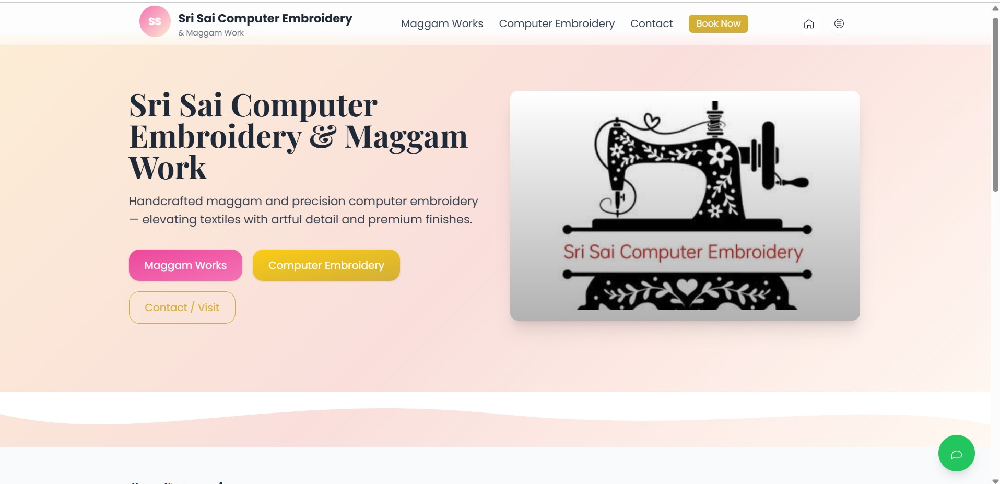
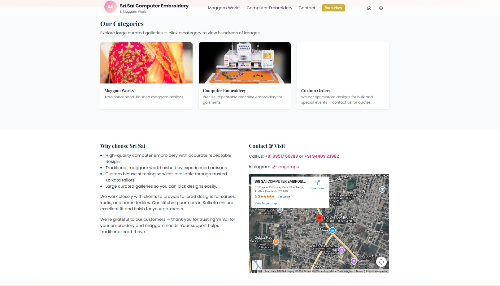
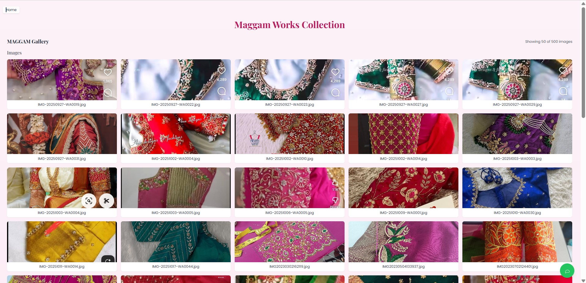
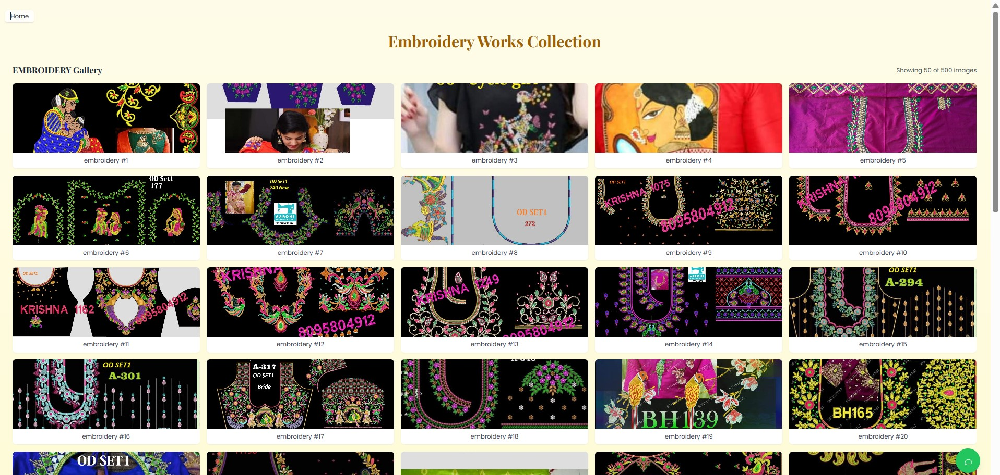

# Embroidery & Maggam Shop

A beautiful React-based showcase website for traditional embroidery and Maggam work. This project displays a curated gallery of handcrafted embroidery designs and traditional maggam artwork with a responsive, modern web interface.

## 🎨 Features

- **Responsive Gallery**: Browse hundreds of embroidery and maggam designs
- **Image Lightbox**: Full-screen viewing with smooth transitions
- **Mobile-Optimized**: Seamless experience on desktop, tablet, and mobile devices
- **Modern UI**: Built with React and Tailwind CSS for a polished look
- **Multi-language Support**: Integrated translation widget for global audience
- **Fast Performance**: Optimized build with efficient asset management

## 🖼️ Gallery Preview

### Website Interface
Our modern, user-friendly interface makes browsing easy:

| Desktop View | Mobile View |
|---|---|
|  |  |

### Featured Artwork

#### Maggam Work


#### Embroidery Work


Experience our complete collection at [Live Demo](https://github.com/HarshaVardhan4223/embroidery-maggam-shop)

## 📁 Project Structure

```
embroidery-maggam-shop/
├── public/                 # Static assets
│   ├── images/
│   │   ├── embroidery/    # Embroidery design images (1000+)
│   │   └── maggam/        # Maggam artwork images (100+)
│   ├── index.html
│   └── manifest.json
├── src/                     # React source code
│   ├── components/
│   │   ├── Header.js       # Navigation header
│   │   ├── Footer.js       # Footer with contact info
│   │   ├── ImageGallery.js # Gallery grid component
│   │   ├── Lightbox.js     # Full-screen image viewer
│   │   ├── FloatingContact.js
│   │   └── TranslateWidget.js
│   ├── pages/
│   │   ├── Home.js         # Landing page
│   │   ├── EmbroideryWorks.js
│   │   └── MaggamWorks.js
│   ├── App.js
│   ├── index.js
│   └── App.css
├── build/                   # Production build output
├── package.json            # Dependencies
└── README.md               # This file

```

## 🛠️ Technology Stack

- **Frontend Framework**: React 18
- **Styling**: Tailwind CSS
- **Build Tool**: Create React App
- **Package Manager**: npm
- **Version Control**: Git

## 🚀 Getting Started

### Prerequisites
- Node.js (v14 or higher)
- npm or yarn

### Installation

1. Clone the repository:
```bash
git clone https://github.com/HarshaVardhan4223/embroidery-maggam-shop.git
cd embroidery-maggam-shop
```

2. Install dependencies:
```bash
npm install
```

3. Start the development server:
```bash
npm start
```

The app will open at [http://localhost:3000](http://localhost:3000)

### Building for Production

```bash
npm run build
```

The optimized build is created in the `build/` folder.

## 📸 Gallery Features

### Image Organization
- **Embroidery Works**: 1000+ high-quality embroidery designs
- **Maggam Works**: 100+ traditional maggam artwork pieces
- **Responsive Images**: Automatically optimized for different screen sizes
- **Image Manifest**: JSON metadata for efficient loading

### Navigation
- Browse gallery by category (Embroidery/Maggam)
- Click any image to open lightbox viewer
- Keyboard navigation in fullscreen mode (arrow keys)
- Share buttons for social media

## 🌍 Internationalization

The site includes a floating translation widget supporting multiple languages:
- English
- Hindi
- Tamil
- And more...

## 📝 Component Details

### ImageGallery Component
Displays grid of craft images with hover effects and lazy loading

### Lightbox Component
Full-screen image viewer with:
- Previous/Next navigation
- Automatic slideshow mode
- Close button and keyboard shortcuts

### TranslateWidget
Multi-language support powered by translation API

## 🔧 Configuration

### Image Paths
Images are stored in:
- `public/images/embroidery/` - Embroidery designs
- `public/images/maggam/` - Maggam artwork

### Customization
Edit `src/App.js` to customize:
- Gallery categories
- Color scheme
- Component layouts
- Navigation structure

## 📦 Built-in Scripts

```bash
npm start          # Run development server
npm run build      # Create production build
npm test           # Run tests
npm run eject      # Eject from CRA (⚠️ irreversible)
```

## 🎯 Performance

- **Optimized Bundle Size**: Minified and gzipped assets
- **Lazy Image Loading**: Images load as user scrolls
- **CSS Optimization**: Tailwind purges unused styles
- **Code Splitting**: Route-based component splitting

## 🤝 Contributing

Contributions are welcome! Please feel free to submit a Pull Request.

## 📄 License

This project is open source and available under the MIT License.

## 👥 Author

**Harsha Vardhan**
- GitHub: [@HarshaVardhan4223](https://github.com/HarshaVardhan4223)
- Email: harshavardhan.sin2005@gmail.com

## 📞 Contact & Support

For inquiries about embroidery and maggam services:
- Use the floating contact form on the website
- Email: [your-email@example.com]
- Phone: [your-phone-number]

## 🙏 Acknowledgments

- React community for excellent documentation
- Tailwind CSS for utility-first styling
- All customers and supporters of traditional craft

---

**Made with ❤️ showcasing traditional embroidery and maggam art**
